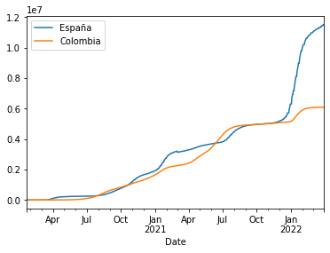

# Uso de API de Covid-19 con Pandas

https://api.covid19api.com/

https://api.covid19api.com

## Instalación Pandas

Lo primero que vamos a hacer es instalar Pandas, que proporciona herramientas que permiten leer y escribir datos en diferentes formatos: CSV, Microsoft Excel, bases SQL y formato HDF5. Además esta herramienta nos permite seleccionar y filtrar de manera sencilla tablas de datos en función de la posición, el valor o las propias etiquetas, así como fusionar y unir datos.


```python
!pip install pandas
```

    Requirement already satisfied: pandas in c:\programdata\anaconda3\lib\site-packages (1.2.4)
    Requirement already satisfied: python-dateutil>=2.7.3 in c:\programdata\anaconda3\lib\site-packages (from pandas) (2.8.1)
    Requirement already satisfied: numpy>=1.16.5 in c:\programdata\anaconda3\lib\site-packages (from pandas) (1.20.1)
    Requirement already satisfied: pytz>=2017.3 in c:\programdata\anaconda3\lib\site-packages (from pandas) (2021.1)
    Requirement already satisfied: six>=1.5 in c:\programdata\anaconda3\lib\site-packages (from python-dateutil>=2.7.3->pandas) (1.15.0)
    

## Configuración

Esta es la parte del código de importación en el que Pandas le dice a Python que traiga la biblioteca de análisis de datos de pandas al entorno actual.

Además la parte del código como `pd` le dice a Python que le de a los pandas el alias de `pd`. Esto le permite usar las funciones de pandas simplemente escribiendo `pd.function_name` en lugar de `pandas.function_name`


```python
import pandas as pd
```

## Variables

Una de las cosas más importantes, por no decir la que más, es definir la URL de la cual queremos extraer los datos. Las variables hay que crearlas al principio... a no ser que tengamos que ir utilizando otras sobre la marcha.


```python
url = 'https://api.covid19api.com/countries'
```

## Creación de *dataframe*

Ahora es cuando conectamos los datos de la API para traerlos aquí. Más tarde usaremos el DataFrame (o la tabla) para organizarlos adecuadamente.
Utilizamos la función `read_json` para leer los datos en JSON dela API:


```python
df = pd.read_json(url)
```


```python
df
```


<div>
<style scoped>
    .dataframe tbody tr th:only-of-type {
        vertical-align: middle;
    }

    .dataframe tbody tr th {
        vertical-align: top;
    }

    .dataframe thead th {
        text-align: right;
    }
</style>
<table border="1" class="dataframe">
  <thead>
    <tr style="text-align: right;">
      <th></th>
      <th>Country</th>
      <th>Slug</th>
      <th>ISO2</th>
    </tr>
  </thead>
  <tbody>
    <tr>
      <th>0</th>
      <td>Republic of Kosovo</td>
      <td>kosovo</td>
      <td>XK</td>
    </tr>
    <tr>
      <th>1</th>
      <td>Botswana</td>
      <td>botswana</td>
      <td>BW</td>
    </tr>
    <tr>
      <th>2</th>
      <td>Central African Republic</td>
      <td>central-african-republic</td>
      <td>CF</td>
    </tr>
    <tr>
      <th>3</th>
      <td>Hungary</td>
      <td>hungary</td>
      <td>HU</td>
    </tr>
    <tr>
      <th>4</th>
      <td>Peru</td>
      <td>peru</td>
      <td>PE</td>
    </tr>
    <tr>
      <th>...</th>
      <td>...</td>
      <td>...</td>
      <td>...</td>
    </tr>
    <tr>
      <th>243</th>
      <td>Malta</td>
      <td>malta</td>
      <td>MT</td>
    </tr>
    <tr>
      <th>244</th>
      <td>San Marino</td>
      <td>san-marino</td>
      <td>SM</td>
    </tr>
    <tr>
      <th>245</th>
      <td>Gibraltar</td>
      <td>gibraltar</td>
      <td>GI</td>
    </tr>
    <tr>
      <th>246</th>
      <td>Uganda</td>
      <td>uganda</td>
      <td>UG</td>
    </tr>
    <tr>
      <th>247</th>
      <td>Vanuatu</td>
      <td>vanuatu</td>
      <td>VU</td>
    </tr>
  </tbody>
</table>
<p>248 rows × 3 columns</p>
</div>


## Explorar tabla
- Cabecera
- Cola
- Descripción

Ahora, en el código podemos poner entre paréntesis el número de filas que queremos visualizar, por si nos resulta más comodo ver un número en concreto.

Por otro lado si dejamos el paréntesis vacío automáticamente el programa nos dara los los 5 primeros valores. Lo hará tanto en la cabecera `head`, como en la cola `tail`.


```python
df.head()
```


<div>
<style scoped>
    .dataframe tbody tr th:only-of-type {
        vertical-align: middle;
    }

    .dataframe tbody tr th {
        vertical-align: top;
    }

    .dataframe thead th {
        text-align: right;
    }
</style>
<table border="1" class="dataframe">
  <thead>
    <tr style="text-align: right;">
      <th></th>
      <th>Country</th>
      <th>Slug</th>
      <th>ISO2</th>
    </tr>
  </thead>
  <tbody>
    <tr>
      <th>0</th>
      <td>Republic of Kosovo</td>
      <td>kosovo</td>
      <td>XK</td>
    </tr>
    <tr>
      <th>1</th>
      <td>Botswana</td>
      <td>botswana</td>
      <td>BW</td>
    </tr>
    <tr>
      <th>2</th>
      <td>Central African Republic</td>
      <td>central-african-republic</td>
      <td>CF</td>
    </tr>
    <tr>
      <th>3</th>
      <td>Hungary</td>
      <td>hungary</td>
      <td>HU</td>
    </tr>
    <tr>
      <th>4</th>
      <td>Peru</td>
      <td>peru</td>
      <td>PE</td>
    </tr>
  </tbody>
</table>
</div>


```python
df.tail()
```


<div>
<style scoped>
    .dataframe tbody tr th:only-of-type {
        vertical-align: middle;
    }

    .dataframe tbody tr th {
        vertical-align: top;
    }

    .dataframe thead th {
        text-align: right;
    }
</style>
<table border="1" class="dataframe">
  <thead>
    <tr style="text-align: right;">
      <th></th>
      <th>Country</th>
      <th>Slug</th>
      <th>ISO2</th>
    </tr>
  </thead>
  <tbody>
    <tr>
      <th>243</th>
      <td>Malta</td>
      <td>malta</td>
      <td>MT</td>
    </tr>
    <tr>
      <th>244</th>
      <td>San Marino</td>
      <td>san-marino</td>
      <td>SM</td>
    </tr>
    <tr>
      <th>245</th>
      <td>Gibraltar</td>
      <td>gibraltar</td>
      <td>GI</td>
    </tr>
    <tr>
      <th>246</th>
      <td>Uganda</td>
      <td>uganda</td>
      <td>UG</td>
    </tr>
    <tr>
      <th>247</th>
      <td>Vanuatu</td>
      <td>vanuatu</td>
      <td>VU</td>
    </tr>
  </tbody>
</table>
</div>


La siguiente función `df.describe()` nos sirve para hacer una descripción numérica de la tabla. Como podemos ver a continuación


```python
df.describe()
```


<div>
<style scoped>
    .dataframe tbody tr th:only-of-type {
        vertical-align: middle;
    }

    .dataframe tbody tr th {
        vertical-align: top;
    }

    .dataframe thead th {
        text-align: right;
    }
</style>
<table border="1" class="dataframe">
  <thead>
    <tr style="text-align: right;">
      <th></th>
      <th>Country</th>
      <th>Slug</th>
      <th>ISO2</th>
    </tr>
  </thead>
  <tbody>
    <tr>
      <th>count</th>
      <td>248</td>
      <td>248</td>
      <td>248</td>
    </tr>
    <tr>
      <th>unique</th>
      <td>248</td>
      <td>248</td>
      <td>248</td>
    </tr>
    <tr>
      <th>top</th>
      <td>Cocos (Keeling) Islands</td>
      <td>somalia</td>
      <td>LY</td>
    </tr>
    <tr>
      <th>freq</th>
      <td>1</td>
      <td>1</td>
      <td>1</td>
    </tr>
  </tbody>
</table>
</div>


La siguiente función `df.info()` nos sirve para visualizar un resumen del dataframe. Este se usa para conocer que no hay celdas vacias y que, por lo tanto, los datos son consistentes.


```python
df.info()
```

    <class 'pandas.core.frame.DataFrame'>
    RangeIndex: 248 entries, 0 to 247
    Data columns (total 3 columns):
     #   Column   Non-Null Count  Dtype 
    ---  ------   --------------  ----- 
     0   Country  248 non-null    object
     1   Slug     248 non-null    object
     2   ISO2     248 non-null    object
    dtypes: object(3)
    memory usage: 5.9+ KB
    

## Acceso a datos

En el acceso a los datos es donde podemos seleccionar lo que queremos ver, por así decir. Si, por ejemplo, quisieramos ver tan solo una de las columnas tendríamos que seleccionar entre corchetes el nombre de la columna que queremos obtener. Aquí veremos un extracto de los primeros y los últimos de toda la lista. Y también nos dirá que tamaño (en números) tiene la lista completa. En el siguiente que vemos, por ejemplo, hay un total de 248.


```python
df['Country']
```


    0            Republic of Kosovo
    1                      Botswana
    2      Central African Republic
    3                       Hungary
    4                          Peru
                     ...           
    243                       Malta
    244                  San Marino
    245                   Gibraltar
    246                      Uganda
    247                     Vanuatu
    Name: Country, Length: 248, dtype: object


Ahora, por ejemplo, queremos saber qué país se encuentra en la posición 200 de la lista anterior. Lo sabemos con el siguiente comando, que nos dice que en este caso es Angola


```python
df['Country'][200]
```


    'Angola'


## Tiempo real España

Ahora queremos conocer cuales son los datos en tiempo real, para ello vamos a usar el código `url_live`. Entonces lo que hacemos es decir que la url, por ejemplo de españa, es `url_es = link de donde queremos extraer los datos`. Debajo pondremos el Data Frame para que nos saque los datos y así veamos si lo hemos hecho bien.


```python
url_es = 'https://api.covid19api.com/country/spain/status/confirmed/live'
df_es = pd.read_json(url_es)
df_es
```


<div>
<style scoped>
    .dataframe tbody tr th:only-of-type {
        vertical-align: middle;
    }

    .dataframe tbody tr th {
        vertical-align: top;
    }

    .dataframe thead th {
        text-align: right;
    }
</style>
<table border="1" class="dataframe">
  <thead>
    <tr style="text-align: right;">
      <th></th>
      <th>Country</th>
      <th>CountryCode</th>
      <th>Province</th>
      <th>City</th>
      <th>CityCode</th>
      <th>Lat</th>
      <th>Lon</th>
      <th>Cases</th>
      <th>Status</th>
      <th>Date</th>
    </tr>
  </thead>
  <tbody>
    <tr>
      <th>0</th>
      <td>Spain</td>
      <td>ES</td>
      <td></td>
      <td></td>
      <td></td>
      <td>40.46</td>
      <td>-3.75</td>
      <td>0</td>
      <td>confirmed</td>
      <td>2020-01-22 00:00:00+00:00</td>
    </tr>
    <tr>
      <th>1</th>
      <td>Spain</td>
      <td>ES</td>
      <td></td>
      <td></td>
      <td></td>
      <td>40.46</td>
      <td>-3.75</td>
      <td>0</td>
      <td>confirmed</td>
      <td>2020-01-23 00:00:00+00:00</td>
    </tr>
    <tr>
      <th>2</th>
      <td>Spain</td>
      <td>ES</td>
      <td></td>
      <td></td>
      <td></td>
      <td>40.46</td>
      <td>-3.75</td>
      <td>0</td>
      <td>confirmed</td>
      <td>2020-01-24 00:00:00+00:00</td>
    </tr>
    <tr>
      <th>3</th>
      <td>Spain</td>
      <td>ES</td>
      <td></td>
      <td></td>
      <td></td>
      <td>40.46</td>
      <td>-3.75</td>
      <td>0</td>
      <td>confirmed</td>
      <td>2020-01-25 00:00:00+00:00</td>
    </tr>
    <tr>
      <th>4</th>
      <td>Spain</td>
      <td>ES</td>
      <td></td>
      <td></td>
      <td></td>
      <td>40.46</td>
      <td>-3.75</td>
      <td>0</td>
      <td>confirmed</td>
      <td>2020-01-26 00:00:00+00:00</td>
    </tr>
    <tr>
      <th>...</th>
      <td>...</td>
      <td>...</td>
      <td>...</td>
      <td>...</td>
      <td>...</td>
      <td>...</td>
      <td>...</td>
      <td>...</td>
      <td>...</td>
      <td>...</td>
    </tr>
    <tr>
      <th>794</th>
      <td>Spain</td>
      <td>ES</td>
      <td></td>
      <td></td>
      <td></td>
      <td>40.46</td>
      <td>-3.75</td>
      <td>11451676</td>
      <td>confirmed</td>
      <td>2022-03-26 00:00:00+00:00</td>
    </tr>
    <tr>
      <th>795</th>
      <td>Spain</td>
      <td>ES</td>
      <td></td>
      <td></td>
      <td></td>
      <td>40.46</td>
      <td>-3.75</td>
      <td>11451676</td>
      <td>confirmed</td>
      <td>2022-03-27 00:00:00+00:00</td>
    </tr>
    <tr>
      <th>796</th>
      <td>Spain</td>
      <td>ES</td>
      <td></td>
      <td></td>
      <td></td>
      <td>40.46</td>
      <td>-3.75</td>
      <td>11451676</td>
      <td>confirmed</td>
      <td>2022-03-28 00:00:00+00:00</td>
    </tr>
    <tr>
      <th>797</th>
      <td>Spain</td>
      <td>ES</td>
      <td></td>
      <td></td>
      <td></td>
      <td>40.46</td>
      <td>-3.75</td>
      <td>11508309</td>
      <td>confirmed</td>
      <td>2022-03-29 00:00:00+00:00</td>
    </tr>
    <tr>
      <th>798</th>
      <td>Spain</td>
      <td>ES</td>
      <td></td>
      <td></td>
      <td></td>
      <td>40.46</td>
      <td>-3.75</td>
      <td>11508309</td>
      <td>confirmed</td>
      <td>2022-03-30 00:00:00+00:00</td>
    </tr>
  </tbody>
</table>
<p>799 rows × 10 columns</p>
</div>


Para conocer toda la información de la tabla tenemos que hacerlo con el código `df_es.info`, como podemos ver a continuación.


```python
df_es.info()
```

    <class 'pandas.core.frame.DataFrame'>
    RangeIndex: 799 entries, 0 to 798
    Data columns (total 10 columns):
     #   Column       Non-Null Count  Dtype              
    ---  ------       --------------  -----              
     0   Country      799 non-null    object             
     1   CountryCode  799 non-null    object             
     2   Province     799 non-null    object             
     3   City         799 non-null    object             
     4   CityCode     799 non-null    object             
     5   Lat          799 non-null    float64            
     6   Lon          799 non-null    float64            
     7   Cases        799 non-null    int64              
     8   Status       799 non-null    object             
     9   Date         799 non-null    datetime64[ns, UTC]
    dtypes: datetime64[ns, UTC](1), float64(2), int64(1), object(6)
    memory usage: 62.5+ KB
    

Ahora queremos hacer un gráfico de línea con los casos que hay en España de coronavirus, con todos los datos del histórico. Para hacerlo tenemos que convertir la columna del `dato de fecha` en la `columna del indice`. Para ello usaremos la función `set_index` para luego, entre paréntesis, añadir que columnas queremos ver primero.


```python
df_es.set_index('Date')
```


<div>
<style scoped>
    .dataframe tbody tr th:only-of-type {
        vertical-align: middle;
    }

    .dataframe tbody tr th {
        vertical-align: top;
    }

    .dataframe thead th {
        text-align: right;
    }
</style>
<table border="1" class="dataframe">
  <thead>
    <tr style="text-align: right;">
      <th></th>
      <th>Country</th>
      <th>CountryCode</th>
      <th>Province</th>
      <th>City</th>
      <th>CityCode</th>
      <th>Lat</th>
      <th>Lon</th>
      <th>Cases</th>
      <th>Status</th>
    </tr>
    <tr>
      <th>Date</th>
      <th></th>
      <th></th>
      <th></th>
      <th></th>
      <th></th>
      <th></th>
      <th></th>
      <th></th>
      <th></th>
    </tr>
  </thead>
  <tbody>
    <tr>
      <th>2020-01-22 00:00:00+00:00</th>
      <td>Spain</td>
      <td>ES</td>
      <td></td>
      <td></td>
      <td></td>
      <td>40.46</td>
      <td>-3.75</td>
      <td>0</td>
      <td>confirmed</td>
    </tr>
    <tr>
      <th>2020-01-23 00:00:00+00:00</th>
      <td>Spain</td>
      <td>ES</td>
      <td></td>
      <td></td>
      <td></td>
      <td>40.46</td>
      <td>-3.75</td>
      <td>0</td>
      <td>confirmed</td>
    </tr>
    <tr>
      <th>2020-01-24 00:00:00+00:00</th>
      <td>Spain</td>
      <td>ES</td>
      <td></td>
      <td></td>
      <td></td>
      <td>40.46</td>
      <td>-3.75</td>
      <td>0</td>
      <td>confirmed</td>
    </tr>
    <tr>
      <th>2020-01-25 00:00:00+00:00</th>
      <td>Spain</td>
      <td>ES</td>
      <td></td>
      <td></td>
      <td></td>
      <td>40.46</td>
      <td>-3.75</td>
      <td>0</td>
      <td>confirmed</td>
    </tr>
    <tr>
      <th>2020-01-26 00:00:00+00:00</th>
      <td>Spain</td>
      <td>ES</td>
      <td></td>
      <td></td>
      <td></td>
      <td>40.46</td>
      <td>-3.75</td>
      <td>0</td>
      <td>confirmed</td>
    </tr>
    <tr>
      <th>...</th>
      <td>...</td>
      <td>...</td>
      <td>...</td>
      <td>...</td>
      <td>...</td>
      <td>...</td>
      <td>...</td>
      <td>...</td>
      <td>...</td>
    </tr>
    <tr>
      <th>2022-03-26 00:00:00+00:00</th>
      <td>Spain</td>
      <td>ES</td>
      <td></td>
      <td></td>
      <td></td>
      <td>40.46</td>
      <td>-3.75</td>
      <td>11451676</td>
      <td>confirmed</td>
    </tr>
    <tr>
      <th>2022-03-27 00:00:00+00:00</th>
      <td>Spain</td>
      <td>ES</td>
      <td></td>
      <td></td>
      <td></td>
      <td>40.46</td>
      <td>-3.75</td>
      <td>11451676</td>
      <td>confirmed</td>
    </tr>
    <tr>
      <th>2022-03-28 00:00:00+00:00</th>
      <td>Spain</td>
      <td>ES</td>
      <td></td>
      <td></td>
      <td></td>
      <td>40.46</td>
      <td>-3.75</td>
      <td>11451676</td>
      <td>confirmed</td>
    </tr>
    <tr>
      <th>2022-03-29 00:00:00+00:00</th>
      <td>Spain</td>
      <td>ES</td>
      <td></td>
      <td></td>
      <td></td>
      <td>40.46</td>
      <td>-3.75</td>
      <td>11508309</td>
      <td>confirmed</td>
    </tr>
    <tr>
      <th>2022-03-30 00:00:00+00:00</th>
      <td>Spain</td>
      <td>ES</td>
      <td></td>
      <td></td>
      <td></td>
      <td>40.46</td>
      <td>-3.75</td>
      <td>11508309</td>
      <td>confirmed</td>
    </tr>
  </tbody>
</table>
<p>799 rows × 9 columns</p>
</div>


Ahora, si queremos que la columna tenga un orden específico y que empiece por un valor específico y continue con otro en particular de los que disponemos, tenemos que ordenarlo de la siguiente manera, el primero entre paréntesis y el segundo entre corchetes. Nosotros queremos que empiece por las fechas y que continúe con los casos.


```python
df_es.set_index('Date')['Cases']
```


    Date
    2020-01-22 00:00:00+00:00           0
    2020-01-23 00:00:00+00:00           0
    2020-01-24 00:00:00+00:00           0
    2020-01-25 00:00:00+00:00           0
    2020-01-26 00:00:00+00:00           0
                                   ...   
    2022-03-26 00:00:00+00:00    11451676
    2022-03-27 00:00:00+00:00    11451676
    2022-03-28 00:00:00+00:00    11451676
    2022-03-29 00:00:00+00:00    11508309
    2022-03-30 00:00:00+00:00    11508309
    Name: Cases, Length: 799, dtype: int64


Si queremos crear una gráfica con estos valores, tenemos que usar la siguiente fórmula en la que utilizaremos un `plot`, en este caso mostramos los casos de coronavirus en una gráfica de línea


```python
df_es.set_index('Date')['Cases'].plot()
```


    <AxesSubplot:xlabel='Date'>


    

    


Queremos que la tabla tenga un título, para ello usamos tras `plot` un paréntesis para darle el nombre que queremos a la tabla


```python
df_es.set_index('Date')['Cases'].plot(title="Casos de Covid-19 en España")
```


    <AxesSubplot:title={'center':'Casos de Covid-19 en España'}, xlabel='Date'>


    

    


## Tiempo real Colombia

También lo podemos hacer con los datos de colombia, cambiando la variable `es` por la variable `co`, correspondiente a este país.


```python
url_co = 'https://api.covid19api.com/country/colombia/status/confirmed/live'
df_co = pd.read_json(url_co)
df_co.set_index('Date')['Cases'].plot(title='Datos de Covid-19 en Colombia')
```


    <AxesSubplot:title={'center':'Datos de Covid-19 en Colombia'}, xlabel='Date'>


    

    


## Comparativa España-Colombia

También podemos hacer gráficos en los que comparamos varios datos. Para eso tenemos que utilizar las dos variables de casos, la de `es` y la de `co`. De esta forma, ejecutandolo, podremos ver la tabla de cada uno y, posteriormente, un gráfico que nos muestre los dos datos.


```python
casos_es = df_es.set_index('Date')['Cases']
casos_co = df_co.set_index('Date')['Cases']
```


```python
casos_co
```


    Date
    2020-01-22 00:00:00+00:00          0
    2020-01-23 00:00:00+00:00          0
    2020-01-24 00:00:00+00:00          0
    2020-01-25 00:00:00+00:00          0
    2020-01-26 00:00:00+00:00          0
                                  ...   
    2022-03-26 00:00:00+00:00    6083291
    2022-03-27 00:00:00+00:00    6083643
    2022-03-28 00:00:00+00:00    6083939
    2022-03-29 00:00:00+00:00    6084240
    2022-03-30 00:00:00+00:00    6084551
    Name: Cases, Length: 799, dtype: int64


```python
casos_es
```


    Date
    2020-01-22 00:00:00+00:00           0
    2020-01-23 00:00:00+00:00           0
    2020-01-24 00:00:00+00:00           0
    2020-01-25 00:00:00+00:00           0
    2020-01-26 00:00:00+00:00           0
                                   ...   
    2022-03-26 00:00:00+00:00    11451676
    2022-03-27 00:00:00+00:00    11451676
    2022-03-28 00:00:00+00:00    11451676
    2022-03-29 00:00:00+00:00    11508309
    2022-03-30 00:00:00+00:00    11508309
    Name: Cases, Length: 799, dtype: int64


```python
pd.concat([casos_es,casos_co],axis=1)
```


<div>
<style scoped>
    .dataframe tbody tr th:only-of-type {
        vertical-align: middle;
    }

    .dataframe tbody tr th {
        vertical-align: top;
    }

    .dataframe thead th {
        text-align: right;
    }
</style>
<table border="1" class="dataframe">
  <thead>
    <tr style="text-align: right;">
      <th></th>
      <th>Cases</th>
      <th>Cases</th>
    </tr>
    <tr>
      <th>Date</th>
      <th></th>
      <th></th>
    </tr>
  </thead>
  <tbody>
    <tr>
      <th>2020-01-22 00:00:00+00:00</th>
      <td>0</td>
      <td>0</td>
    </tr>
    <tr>
      <th>2020-01-23 00:00:00+00:00</th>
      <td>0</td>
      <td>0</td>
    </tr>
    <tr>
      <th>2020-01-24 00:00:00+00:00</th>
      <td>0</td>
      <td>0</td>
    </tr>
    <tr>
      <th>2020-01-25 00:00:00+00:00</th>
      <td>0</td>
      <td>0</td>
    </tr>
    <tr>
      <th>2020-01-26 00:00:00+00:00</th>
      <td>0</td>
      <td>0</td>
    </tr>
    <tr>
      <th>...</th>
      <td>...</td>
      <td>...</td>
    </tr>
    <tr>
      <th>2022-03-26 00:00:00+00:00</th>
      <td>11451676</td>
      <td>6083291</td>
    </tr>
    <tr>
      <th>2022-03-27 00:00:00+00:00</th>
      <td>11451676</td>
      <td>6083643</td>
    </tr>
    <tr>
      <th>2022-03-28 00:00:00+00:00</th>
      <td>11451676</td>
      <td>6083939</td>
    </tr>
    <tr>
      <th>2022-03-29 00:00:00+00:00</th>
      <td>11508309</td>
      <td>6084240</td>
    </tr>
    <tr>
      <th>2022-03-30 00:00:00+00:00</th>
      <td>11508309</td>
      <td>6084551</td>
    </tr>
  </tbody>
</table>
<p>799 rows × 2 columns</p>
</div>


```python
vs = pd.concat([casos_es,casos_co],axis=1)
vs
```


<div>
<style scoped>
    .dataframe tbody tr th:only-of-type {
        vertical-align: middle;
    }

    .dataframe tbody tr th {
        vertical-align: top;
    }

    .dataframe thead th {
        text-align: right;
    }
</style>
<table border="1" class="dataframe">
  <thead>
    <tr style="text-align: right;">
      <th></th>
      <th>Cases</th>
      <th>Cases</th>
    </tr>
    <tr>
      <th>Date</th>
      <th></th>
      <th></th>
    </tr>
  </thead>
  <tbody>
    <tr>
      <th>2020-01-22 00:00:00+00:00</th>
      <td>0</td>
      <td>0</td>
    </tr>
    <tr>
      <th>2020-01-23 00:00:00+00:00</th>
      <td>0</td>
      <td>0</td>
    </tr>
    <tr>
      <th>2020-01-24 00:00:00+00:00</th>
      <td>0</td>
      <td>0</td>
    </tr>
    <tr>
      <th>2020-01-25 00:00:00+00:00</th>
      <td>0</td>
      <td>0</td>
    </tr>
    <tr>
      <th>2020-01-26 00:00:00+00:00</th>
      <td>0</td>
      <td>0</td>
    </tr>
    <tr>
      <th>...</th>
      <td>...</td>
      <td>...</td>
    </tr>
    <tr>
      <th>2022-03-26 00:00:00+00:00</th>
      <td>11451676</td>
      <td>6083291</td>
    </tr>
    <tr>
      <th>2022-03-27 00:00:00+00:00</th>
      <td>11451676</td>
      <td>6083643</td>
    </tr>
    <tr>
      <th>2022-03-28 00:00:00+00:00</th>
      <td>11451676</td>
      <td>6083939</td>
    </tr>
    <tr>
      <th>2022-03-29 00:00:00+00:00</th>
      <td>11508309</td>
      <td>6084240</td>
    </tr>
    <tr>
      <th>2022-03-30 00:00:00+00:00</th>
      <td>11508309</td>
      <td>6084551</td>
    </tr>
  </tbody>
</table>
<p>799 rows × 2 columns</p>
</div>


Ahora le vamos a decir que `vs` sea igual a España y Colombia, para no tener que poner luego la formula completa, sino simplemente nos funcione poniendo `vs`


```python
vs.columns = ['España','Colombia']
vs
```


<div>
<style scoped>
    .dataframe tbody tr th:only-of-type {
        vertical-align: middle;
    }

    .dataframe tbody tr th {
        vertical-align: top;
    }

    .dataframe thead th {
        text-align: right;
    }
</style>
<table border="1" class="dataframe">
  <thead>
    <tr style="text-align: right;">
      <th></th>
      <th>España</th>
      <th>Colombia</th>
    </tr>
    <tr>
      <th>Date</th>
      <th></th>
      <th></th>
    </tr>
  </thead>
  <tbody>
    <tr>
      <th>2020-01-22 00:00:00+00:00</th>
      <td>0</td>
      <td>0</td>
    </tr>
    <tr>
      <th>2020-01-23 00:00:00+00:00</th>
      <td>0</td>
      <td>0</td>
    </tr>
    <tr>
      <th>2020-01-24 00:00:00+00:00</th>
      <td>0</td>
      <td>0</td>
    </tr>
    <tr>
      <th>2020-01-25 00:00:00+00:00</th>
      <td>0</td>
      <td>0</td>
    </tr>
    <tr>
      <th>2020-01-26 00:00:00+00:00</th>
      <td>0</td>
      <td>0</td>
    </tr>
    <tr>
      <th>...</th>
      <td>...</td>
      <td>...</td>
    </tr>
    <tr>
      <th>2022-03-26 00:00:00+00:00</th>
      <td>11451676</td>
      <td>6083291</td>
    </tr>
    <tr>
      <th>2022-03-27 00:00:00+00:00</th>
      <td>11451676</td>
      <td>6083643</td>
    </tr>
    <tr>
      <th>2022-03-28 00:00:00+00:00</th>
      <td>11451676</td>
      <td>6083939</td>
    </tr>
    <tr>
      <th>2022-03-29 00:00:00+00:00</th>
      <td>11508309</td>
      <td>6084240</td>
    </tr>
    <tr>
      <th>2022-03-30 00:00:00+00:00</th>
      <td>11508309</td>
      <td>6084551</td>
    </tr>
  </tbody>
</table>
<p>799 rows × 2 columns</p>
</div>


Si añadimos al paréntesis del plot un `kind=` y utilizamos las varias formas que hay, podemos ver diferentes formas de crear gráficas. Ademas de la que se muestra a continuación `area` tambien existe `bar`, `barh` o `hist`, entre otras


```python
vs.plot(title="España VS Colombia", kind='area')
```


    <AxesSubplot:title={'center':'España VS Colombia'}, xlabel='Date'>


    

    


## Triple comparativa

También podemos hacer una comparativa entre tres países, y lo hacemos con una variable más. Nosotros hemos añadido portugal, por eso usarmos los datos de `pt` que es el que corresponde al país.


```python
url_pt = 'https://api.covid19api.com/country/portugal/status/confirmed/live'
df_pt = pd.read_json(url_pt)
df_pt.set_index('Date')
df_pt.set_index('Date')['Cases']
casos_pt = df_pt.set_index('Date')['Cases']
vs2 = pd.concat([casos_es,casos_co,casos_pt],axis=1)
vs2.columns = ['España','Colombia','Portugal']
vs2.plot(title="Triple comparativa España VS Colombia VS Portugal")
```


    <AxesSubplot:title={'center':'Triple comparativa España VS Colombia VS Portugal'}, xlabel='Date'>


    

    


## Seleccionar más columnas


```python
df_es.set_index('Date')[['Cases','Lon',]]
```


<div>
<style scoped>
    .dataframe tbody tr th:only-of-type {
        vertical-align: middle;
    }

    .dataframe tbody tr th {
        vertical-align: top;
    }

    .dataframe thead th {
        text-align: right;
    }
</style>
<table border="1" class="dataframe">
  <thead>
    <tr style="text-align: right;">
      <th></th>
      <th>Cases</th>
      <th>Lon</th>
    </tr>
    <tr>
      <th>Date</th>
      <th></th>
      <th></th>
    </tr>
  </thead>
  <tbody>
    <tr>
      <th>2020-01-22 00:00:00+00:00</th>
      <td>0</td>
      <td>-3.75</td>
    </tr>
    <tr>
      <th>2020-01-23 00:00:00+00:00</th>
      <td>0</td>
      <td>-3.75</td>
    </tr>
    <tr>
      <th>2020-01-24 00:00:00+00:00</th>
      <td>0</td>
      <td>-3.75</td>
    </tr>
    <tr>
      <th>2020-01-25 00:00:00+00:00</th>
      <td>0</td>
      <td>-3.75</td>
    </tr>
    <tr>
      <th>2020-01-26 00:00:00+00:00</th>
      <td>0</td>
      <td>-3.75</td>
    </tr>
    <tr>
      <th>...</th>
      <td>...</td>
      <td>...</td>
    </tr>
    <tr>
      <th>2022-03-26 00:00:00+00:00</th>
      <td>11451676</td>
      <td>-3.75</td>
    </tr>
    <tr>
      <th>2022-03-27 00:00:00+00:00</th>
      <td>11451676</td>
      <td>-3.75</td>
    </tr>
    <tr>
      <th>2022-03-28 00:00:00+00:00</th>
      <td>11451676</td>
      <td>-3.75</td>
    </tr>
    <tr>
      <th>2022-03-29 00:00:00+00:00</th>
      <td>11508309</td>
      <td>-3.75</td>
    </tr>
    <tr>
      <th>2022-03-30 00:00:00+00:00</th>
      <td>11508309</td>
      <td>-3.75</td>
    </tr>
  </tbody>
</table>
<p>799 rows × 2 columns</p>
</div>


## Exportar datos

Lo ultimo que queremos hacer es guardar los datos en CSV `Valores Separados por Comas`, son el tipo de datos mayoritarios porque apenas pesa. Los datos que generamos los podemos guardar tanto en CSV, para poder llevarlo a otro formato, o también podemos crearlo en PNG, para que nos cree una imagen que podamos descargar.


```python
vs.to_csv('vs.csv')
vs2.to_csv ('vs2.csv')
```

La siguiente fórmula nos sirve para exportar en png un gráfico, que se queda guardado en la carpeta que hemos creado para este proyecto


```python
grafico = vs.plot()
fig = grafico.get_figure()
fig.savefig("vs.png")
```


    

    


```python
grafico = vs2.plot()
fig = grafico.get_figure()
fig.savefig("vs2.png")
```


    

    


```python

```
